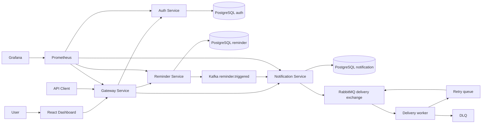
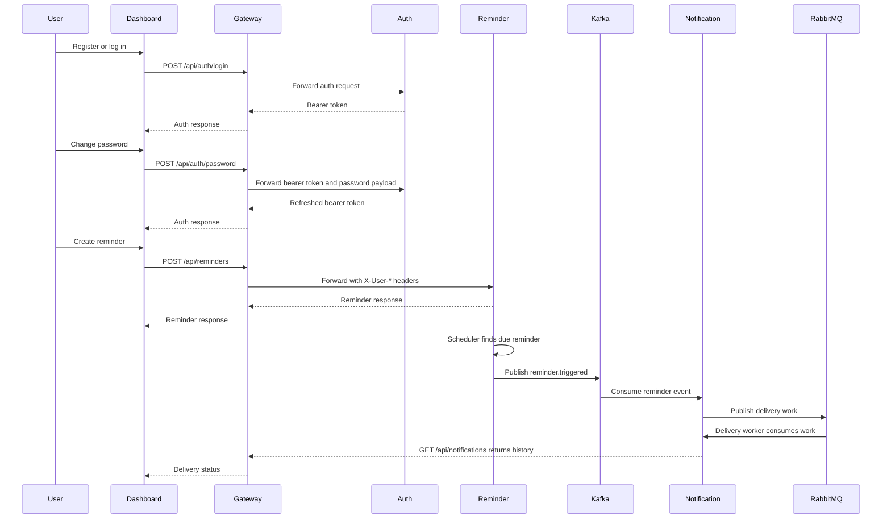

# Architecture Overview

NotifyHub is organized around a public Gateway Service, three domain services, a React dashboard and local infrastructure for persistence, messaging and monitoring.

## Service Boundaries

- Gateway Service owns the external API surface, JWT verification and identity header propagation.
- Auth Service owns registration, login, password changes, password hashing, user roles and token issuing.
- Reminder Service owns reminder CRUD, owner checks, due reminder detection and Kafka event publishing.
- Notification Service owns notification logs, idempotency, delivery attempts, RabbitMQ dispatch, retry and DLQ handling.
- Dashboard owns the browser workflow for auth, profile settings, reminder management, notification history and delivery metrics. Runtime topology and event-stream panels are isolated to the Overview page instead of repeating across operational pages.

## Runtime Flow

## Data Ownership

Each backend service owns its database schema. The local Docker Compose stack starts one PostgreSQL container with separate logical databases initialized for auth, reminder and notification data.

## Messaging Responsibilities

Kafka is used for durable domain events between Reminder Service and Notification Service. RabbitMQ is used for channel delivery work where retry, delay and DLQ behavior are operational concerns close to notification delivery.

## Observability

All backend services expose Spring Boot Actuator health and Prometheus metrics. Prometheus scrapes the services and Grafana provisions the `NotifyHub Overview` dashboard from repository files.
